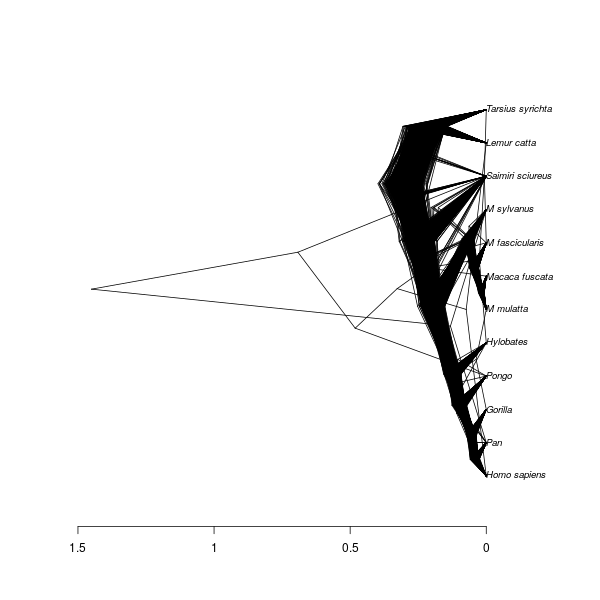

# babette_example_7

Branch   |[](https://travis-ci.org)                                                                                           |[](https://appveyor.com)                                                                                               
---------|--------------------------------------------------------------------------------------------------------------------------------------------------------|--------------------------------------------------------------------------------------------------------------------------------------------------------------------------------------------
`master` |[](https://travis-ci.org/richelbilderbeek/babette_example_7) |[](https://ci.appveyor.com/project/richelbilderbeek/babette-example-7/branch/master)
`develop`|[](https://travis-ci.org/richelbilderbeek/babette_example_7)|[](https://ci.appveyor.com/project/richelbilderbeek/babette-example-7/branch/develop)

A [babette example](https://github.com/richelbilderbeek/babette_examples).

## Example #7: HKY site model with a non-zero proportion of invariants


```{r}
posterior <- bbt_run(
  "my_alignment.fas",
  site_model = create_hky_site_model(
    gamma_site_model = create_gamma_site_model(prop_invariant = 0.5)
  )
)
```

Thanks to Yacine Ben Chehida for this use case

## Result


